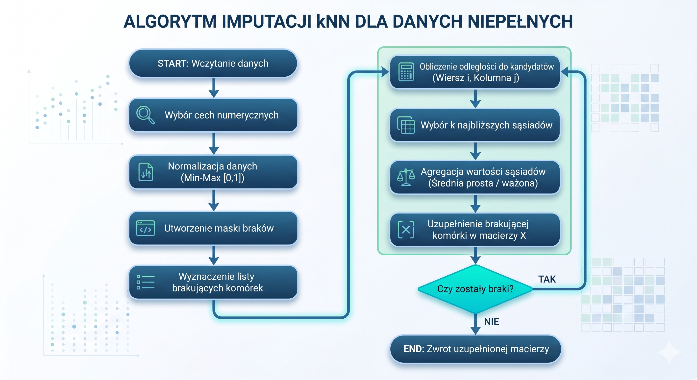

# Projekt z przedmiotu MED - Etap 1: projekt implementacji

**Temat:** 7.3. Wnioskowanie z niepełnych danych z wykorzystaniem imputacji kNN  
**Autor:** Adam Sokołowski  
**Termin przedstawienia kluczowych elementów rozwiązania:** 08.05.2026

## 1. Cel i zakres projektu

Celem projektu jest przygotowanie oraz późniejsza implementacja algorytmu imputacji brakujących wartości metodą k-Nearest Neighbors. Rozwiązanie ma uzupełniać braki w danych numerycznych na podstawie najbardziej podobnych rekordów, a następnie zostać ocenione pod względem jakości imputacji oraz efektywności obliczeniowej.

Projekt implementacji obejmuje:

- strukturę modułów, klas i funkcji planowanego programu;
- opis struktur danych przechowujących dane źródłowe, maski braków, odległości, sąsiadów oraz wyniki eksperymentów;
- mapowanie metod programu na konkretne kroki algorytmu kNN;
- plan testów poprawności, jakości i wydajności;
- ocenę oczekiwanej złożoności czasowej i pamięciowej.

Ten dokument nie jest implementacją. Stanowi opis techniczny rozwiązania, które zostanie zaimplementowane w kolejnym etapie.

## 2. Wybrane technologie

Do realizacji projektu zostanie wykorzystany język **Python**, ponieważ dobrze wspiera obliczenia numeryczne, eksperymenty na danych oraz szybkie przygotowanie wizualizacji wyników.

Planowane biblioteki:

- `numpy` - reprezentacja danych w postaci macierzy, operacje wektorowe, obliczanie odległości;
- `pandas` - wczytywanie danych z plików CSV, podstawowa obróbka tabelaryczna, raportowanie wyników;
- `matplotlib` - tworzenie wykresów czasu działania, RMSE i skalowalności;
- `scikit-learn` - tylko jako punkt odniesienia do porównania wyników, nie jako główna implementacja algorytmu.

Rdzeń algorytmu, czyli obliczanie odległości, wybór sąsiadów i imputacja wartości, zostanie zaimplementowany samodzielnie.

## 3. Planowana struktura implementacji

Kod zostanie podzielony na moduły odpowiadające etapom przetwarzania danych i eksperymentów.

| Moduł | Odpowiedzialność |
| --- | --- |
| `data_loader.py` | Wczytywanie zbiorów danych, wybór kolumn numerycznych, konwersja do struktur `numpy`. |
| `preprocessing.py` | Normalizacja, wykrywanie braków, tworzenie masek brakujących wartości. |
| `knn_imputer.py` | Właściwy algorytm imputacji kNN. |
| `metrics.py` | Obliczanie RMSE, MAE oraz statystyk czasu wykonania. |
| `experiments.py` | Uruchamianie serii eksperymentów dla różnych zbiorów, poziomów braków i wartości `k`. |
| `visualization.py` | Generowanie wykresów i tabel do raportu oraz prezentacji. |
| `main.py` | Punkt wejścia programu, konfiguracja eksperymentów. |

### 3.1. Klasa `DatasetLoader`

Klasa odpowiada za pobranie danych z pliku i przygotowanie ich do dalszych kroków.

Planowane metody:

- `load_csv(path: str) -> pandas.DataFrame` - wczytuje plik z danymi źródłowymi;
- `select_numeric_columns(df: pandas.DataFrame) -> pandas.DataFrame` - wybiera kolumny numeryczne;
- `to_numpy(df: pandas.DataFrame) -> numpy.ndarray` - konwertuje dane tabelaryczne na macierz numeryczną.

Wynikiem pracy klasy będzie macierz `X` o rozmiarze `n x m`, gdzie `n` oznacza liczbę rekordów, a `m` liczbę cech.

### 3.2. Klasa `Preprocessor`

Klasa odpowiada za przygotowanie danych przed imputacją.

Planowane metody:

- `fit_minmax(X: numpy.ndarray) -> None` - oblicza minima i maksima kolumn;
- `transform_minmax(X: numpy.ndarray) -> numpy.ndarray` - normalizuje wartości do przedziału `[0, 1]`;
- `inverse_transform_minmax(X: numpy.ndarray) -> numpy.ndarray` - przywraca oryginalną skalę danych;
- `build_missing_mask(X: numpy.ndarray) -> numpy.ndarray` - tworzy maskę logiczną braków danych;
- `inject_missing_values(X: numpy.ndarray, missing_rate: float, seed: int) -> tuple[numpy.ndarray, numpy.ndarray]` - generuje kontrolowane braki danych do testów.

Normalizacja jest osobnym krokiem, ponieważ metoda kNN jest wrażliwa na skalę cech. Bez tego cechy o dużych wartościach liczbowych mogłyby dominować w obliczaniu odległości.

### 3.3. Klasa `KNNImputer`

Najważniejszym elementem implementacji będzie klasa `KNNImputer`, przechowująca parametry algorytmu i realizująca imputację.

Planowane pola klasy:

- `k: int` - liczba najbliższych sąsiadów;
- `weights: str` - sposób agregacji wartości: `uniform` albo `distance`;
- `epsilon: float` - mała stała zabezpieczająca przed dzieleniem przez zero;
- `X_: numpy.ndarray` - kopia danych poddawanych imputacji;
- `missing_mask_: numpy.ndarray` - macierz logiczna wskazująca brakujące komórki.

Planowane metody:

- `fit_transform(X: numpy.ndarray) -> numpy.ndarray` - główna metoda uruchamiająca cały algorytm imputacji;
- `_find_missing_cells(mask: numpy.ndarray) -> list[tuple[int, int]]` - zwraca listę współrzędnych brakujących komórek;
- `_distance(row_a: numpy.ndarray, row_b: numpy.ndarray, target_col: int) -> float` - oblicza zmodyfikowaną odległość euklidesową;
- `_find_neighbors(row_idx: int, col_idx: int) -> list[tuple[float, float]]` - wyszukuje `k` najbliższych rekordów posiadających znaną wartość w imputowanej kolumnie;
- `_aggregate(neighbors: list[tuple[float, float]]) -> float` - wylicza wartość zastępczą na podstawie sąsiadów;
- `_fallback_column_value(col_idx: int) -> float` - zwraca średnią lub medianę kolumny, gdy nie da się znaleźć wystarczających sąsiadów.

Metody pomocnicze są oznaczone podkreśleniem, ponieważ będą szczegółem implementacyjnym klasy, a nie publicznym API programu.

### 3.4. Klasa `ExperimentRunner`

Klasa będzie odpowiadała za automatyczne uruchamianie eksperymentów.

Planowane metody:

- `run_quality_experiment(dataset_name: str, missing_rates: list[float], k_values: list[int]) -> pandas.DataFrame` - testuje jakość imputacji dla różnych poziomów braków i wartości `k`;
- `run_scalability_experiment(dataset_name: str, row_sizes: list[int], column_sizes: list[int]) -> pandas.DataFrame` - mierzy czas działania dla rosnącej liczby rekordów i cech;
- `run_baseline_comparison(dataset_name: str) -> pandas.DataFrame` - porównuje wynik z imputacją średnią/medianą oraz `KNNImputer` ze `scikit-learn`;
- `save_results(results: pandas.DataFrame, path: str) -> None` - zapisuje wyniki do pliku CSV.

### 3.5. Funkcje pomocnicze

Dodatkowo powstaną funkcje niezależne od klas:

- `rmse(y_true: numpy.ndarray, y_pred: numpy.ndarray) -> float` - błąd średniokwadratowy pierwiastkowy;
- `mae(y_true: numpy.ndarray, y_pred: numpy.ndarray) -> float` - średni błąd bezwzględny;
- `measure_time(function, *args, **kwargs) -> tuple[object, float]` - pomiar czasu wykonania wybranej operacji;
- `plot_metric(results: pandas.DataFrame, x: str, y: str, group: str, output_path: str) -> None` - zapis wykresu do pliku.

## 4. Struktury danych

W projekcie zostaną wykorzystane następujące struktury danych:

| Struktura | Typ | Zastosowanie |
| --- | --- | --- |
| Dane źródłowe | `pandas.DataFrame` | Wczytanie i wstępna inspekcja danych z pliku. |
| Macierz danych | `numpy.ndarray` | Główna reprezentacja danych numerycznych podczas obliczeń. |
| Braki danych | `numpy.nan` | Oznaczenie pustych komórek w macierzy danych. |
| Maska braków | `numpy.ndarray` typu `bool` | Informacja, które komórki wymagają imputacji. |
| Lista brakujących komórek | `list[tuple[int, int]]` | Kolejność przetwarzania braków: indeks wiersza i kolumny. |
| Lista sąsiadów | `list[tuple[float, float]]` | Pary: odległość do sąsiada oraz jego wartość w imputowanej kolumnie. |
| Wyniki eksperymentów | `pandas.DataFrame` | Tabela z konfiguracją testu, czasem działania i metrykami jakości. |
| Konfiguracja eksperymentu | `dict` | Parametry: zbiór danych, poziom braków, `k`, sposób ważenia, liczba powtórzeń. |

## 5. Projekt algorytmu imputacji kNN

Algorytm będzie działał według poniższej sekwencji.



### Krok 1. Wczytanie i przygotowanie danych

Realizowany przez `DatasetLoader.load_csv`, `DatasetLoader.select_numeric_columns`, `DatasetLoader.to_numpy` oraz `Preprocessor.transform_minmax`.

Dane zostaną wczytane do `DataFrame`, ograniczone do cech numerycznych, a następnie przekonwertowane na macierz `numpy.ndarray`. Przed obliczaniem odległości każda cecha zostanie znormalizowana do tego samego zakresu.

### Krok 2. Wykrycie braków danych

Realizowany przez `Preprocessor.build_missing_mask` oraz `KNNImputer._find_missing_cells`.

Dla macierzy `X` zostanie utworzona macierz logiczna `missing_mask`, w której `True` oznacza brak danych. Na jej podstawie powstanie lista komórek do uzupełnienia, np. `[(2, 4), (10, 1), (10, 3)]`.

### Krok 3. Obliczanie odległości

Realizowany przez `KNNImputer._distance`.

Dla brakującej komórki `(i, j)` algorytm porówna rekord `i` z innymi rekordami. Kandydatem na sąsiada może być tylko rekord, który posiada znaną wartość w kolumnie `j`. Odległość będzie liczona tylko po tych cechach, które są znane w obu porównywanych rekordach i nie są aktualnie imputowaną kolumną.

Planowana postać odległości:

```text
distance(a, b) = sqrt(sum((a_t - b_t)^2) / liczba_wspólnych_cech)
```

Jeżeli dwa rekordy nie mają żadnej wspólnej znanej cechy, kandydat zostanie pominięty.

### Krok 4. Wybór najbliższych sąsiadów

Realizowany przez `KNNImputer._find_neighbors`.

Algorytm obliczy odległości do wszystkich poprawnych kandydatów, posortuje je rosnąco i wybierze pierwsze `k` rekordów. Każdy sąsiad będzie reprezentowany jako para:

```text
(odległość_do_rekordu, wartość_w_imputowanej_kolumnie)
```

W implementacji podstawowej wystarczy sortowanie listy kandydatów. Wariant optymalizacyjny może wykorzystywać kopiec lub `numpy.argpartition`, aby szybciej wybrać tylko `k` najmniejszych wartości.

### Krok 5. Agregacja i imputacja

Realizowany przez `KNNImputer._aggregate`.

Zostaną przygotowane dwa warianty agregacji:

- `uniform` - średnia arytmetyczna wartości sąsiadów;
- `distance` - średnia ważona odwrotnością odległości.

Dla wariantu ważonego planowany wzór ma postać:

```text
waga_sąsiada = 1 / (odległość + epsilon)
wartość = sum(waga_sąsiada * wartość_sąsiada) / sum(wag)
```

Jeżeli nie uda się znaleźć żadnego poprawnego sąsiada, metoda `_fallback_column_value` uzupełni wartość średnią lub medianą z danej kolumny.

## 6. Ocena efektywności proponowanego rozwiązania

Niech:

- `n` oznacza liczbę rekordów;
- `m` oznacza liczbę cech;
- `r` oznacza liczbę brakujących komórek;
- `k` oznacza liczbę wybieranych sąsiadów.

Dla jednej brakującej komórki algorytm porównuje rekord z maksymalnie `n - 1` kandydatami. Obliczenie jednej odległości wymaga przejścia po maksymalnie `m` cechach. Złożoność obliczenia odległości dla jednej komórki wynosi więc `O(n * m)`.

Po obliczeniu odległości wybór sąsiadów przez sortowanie ma złożoność `O(n log n)`. Dla całego zbioru braków podstawowa złożoność czasowa wynosi:

```text
O(r * (n * m + n log n))
```

W praktyce dominującym elementem będzie zwykle obliczanie odległości, szczególnie dla zbiorów o dużej liczbie cech. Jeżeli zostanie zastosowane `numpy.argpartition` lub kopiec ograniczony do `k` elementów, wybór sąsiadów można ograniczyć do około `O(n)` albo `O(n log k)`.

Złożoność pamięciowa:

- macierz danych: `O(n * m)`;
- maska braków: `O(n * m)`;
- lista kandydatow dla jednej imputacji: `O(n)`;
- tabela wyników eksperymentów: zależy od liczby konfiguracji testowych, zwykle znacznie mniej niż dane źródłowe.

Oczekiwanym ograniczeniem rozwiązania jest wysoki koszt dla dużych zbiorów, szczególnie gdy jednocześnie rośnie liczba rekordów, liczba cech i liczba braków. Dlatego w eksperymentach zostanie osobno zbadany wpływ `n`, `m`, `r` oraz `k` na czas działania.

## 7. Zbiory danych

Do eksperymentów zostaną wykorzystane zbiory różniące się liczbą rekordów, liczbą cech i charakterem braków:

1. **Gene Expression Cancer RNA-Seq** - zbiór medyczny o bardzo dużej liczbie atrybutów. Pozwoli sprawdzić skalowalność względem liczby cech.
2. **Adult / Census Income** - zbiór z dużą liczbą rekordów i mniejszą liczbą cech. Pozwoli sprawdzić skalowalność względem liczby wierszy.
3. **Breast Cancer Wisconsin** - zbiór związany z danymi medycznymi, przydatny do testów na danych z naturalnymi albo łatwo symulowanymi brakami.

Dla zbiorów kompletnych braki zostaną wygenerowane sztucznie, aby znać prawdziwe wartości i móc policzyć błąd imputacji.

## 8. Plan testów

### 8.1. Testy poprawności jednostkowej

Planowane testy:

- sprawdzenie, czy `build_missing_mask` poprawnie wykrywa wartości `NaN`;
- sprawdzenie, czy normalizacja zachowuje wartości w przedziale `[0, 1]`;
- sprawdzenie, czy `_distance` pomija cechy z brakami;
- sprawdzenie, czy `_find_neighbors` wybiera tylko rekordy ze znaną wartością w imputowanej kolumnie;
- sprawdzenie, czy `_aggregate` zwraca poprawną średnią prostą i ważoną.

### 8.2. Testy jakości imputacji

Procedura:

1. Wybrać kompletny podzbiór danych.
2. Wygenerować braki MCAR na poziomach `5%`, `15%`, `30%`.
3. Uruchomić imputację dla `k = 3, 5, 7, 11`.
4. Porównać wartości odtworzone z wartościami oryginalnymi.
5. Obliczyć `RMSE` oraz `MAE`.
6. Powtórzyć eksperyment kilka razy z różnymi ziarnami losowymi i uśrednić wyniki.

### 8.3. Testy wydajności i skalowalności

Planowane pomiary:

- czas imputacji przy rosnącej liczbie rekordów `n`;
- czas imputacji przy rosnącej liczbie cech `m`;
- czas imputacji przy rosnącym poziomie braków `r`;
- wpływ wartości `k` na czas wykonania i jakość wyniku.

Wyniki zostaną zapisane do CSV, a następnie przedstawione na wykresach.

### 8.4. Porównania referencyjne

Wyniki autorskiej implementacji zostaną porównane z:

- imputacją średnią kolumny;
- imputacją medianą kolumny;
- `KNNImputer` z biblioteki `scikit-learn`.

Porównanie ma pokazać, czy metoda kNN daje lepszą jakość niż proste metody oraz czy ręczna implementacja zachowuje się zgodnie z oczekiwaniami.
