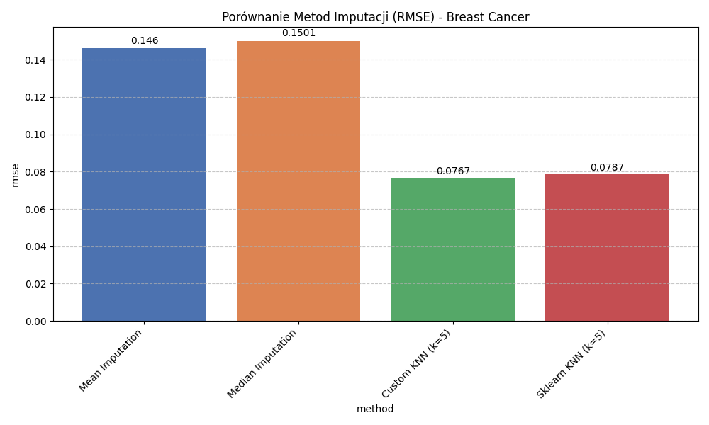
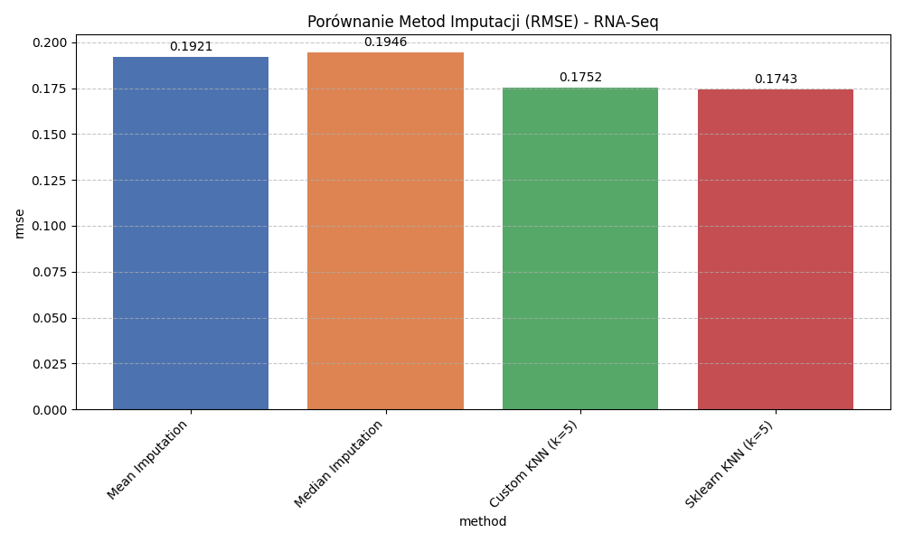
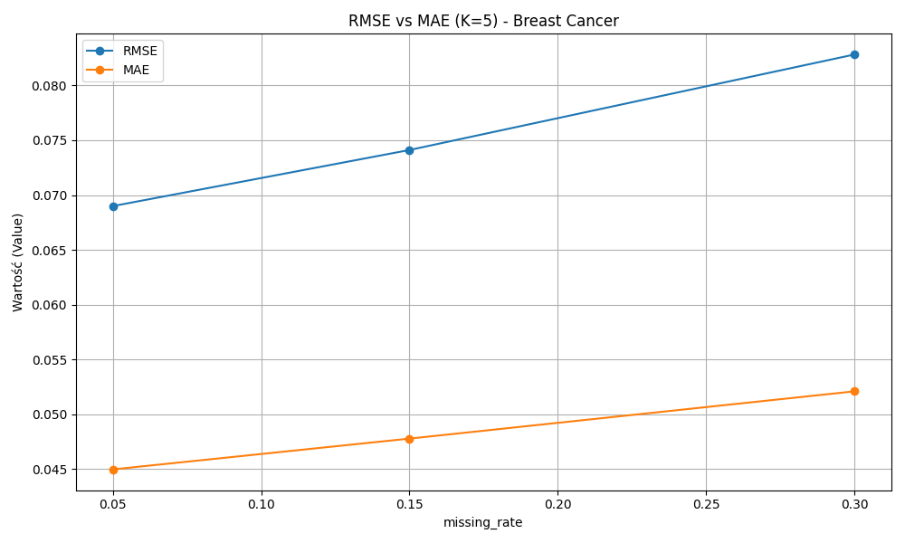
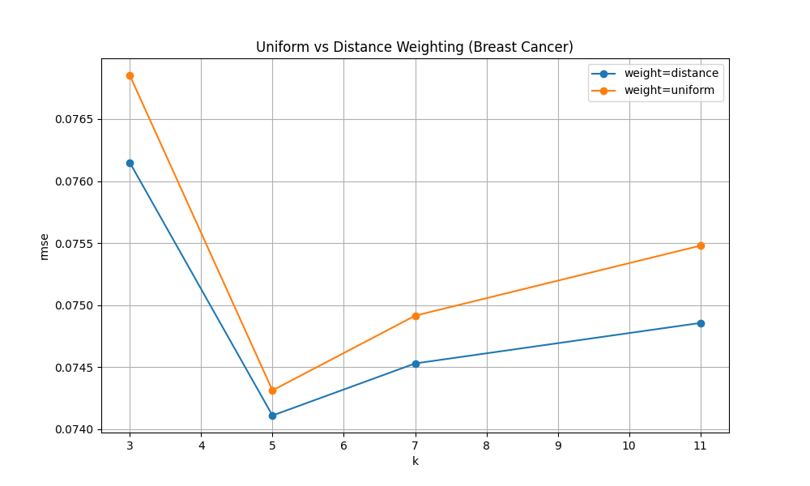
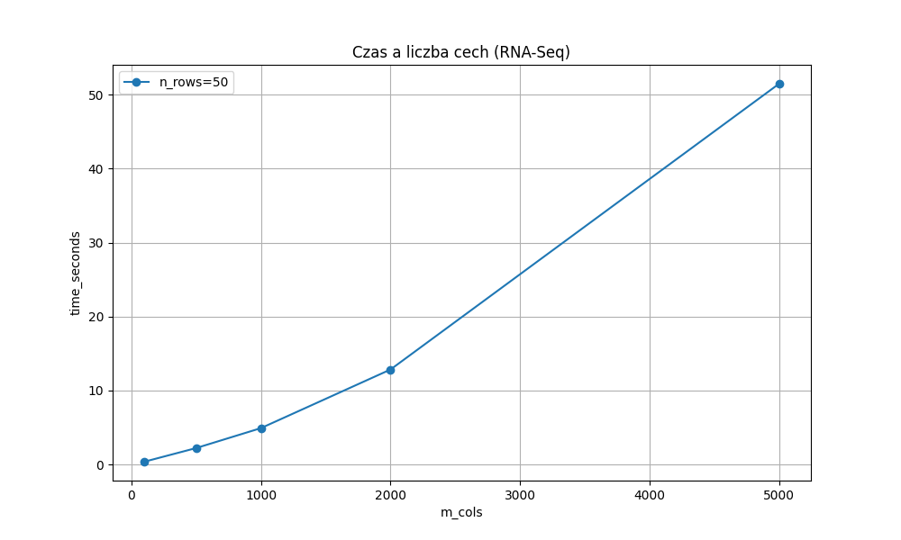
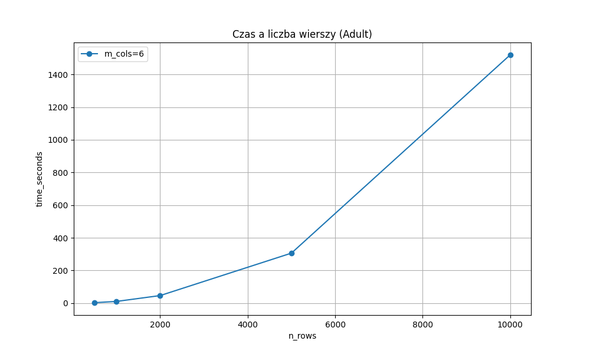

# Raport Końcowy z Projektu: Wnioskowanie z niepełnych danych z wykorzystaniem imputacji kNN

## 1. Wprowadzenie i Cel Projektu
Braki w danych to jeden z najczęstszych problemów w analizie danych statystycznych oraz uczeniu maszynowym. Powszechną praktyką jest całkowite usuwanie uszkodzonych rekordów lub wypełnianie ich zwykłą średnią, co prowadzi do utraty cennych informacji lub wprowadzenia sztucznego szumu. 

Celem niniejszego projektu było **zaprojektowanie, zaimplementowanie i dogłębne przetestowanie autorskiego algorytmu imputacji metodą k-Nearest Neighbors (kNN)**. Algorytm kNN podchodzi do problemu znacznie inteligentniej – uzupełnia brakujące wartości na podstawie `k` najbardziej podobnych do siebie rekordów, analizując ukryte wzorce i korelacje w zbiorze danych.

## 2. Metodyka i Architektura Rozwiązania
Projekt zrealizowano w całości w języku **Python**, opierając się na bibliotekach numerycznych `numpy` oraz `pandas`.
Zastosowano modularną architekturę oprogramowania, dzielącą proces badawczy na kilka niezależnych kroków. Głównymi komponentami są:

* **`Preprocessor`** – moduł dbający o integralność danych. Odpowiada za kluczową w algorytmach odległościowych normalizację (MinMaxScaler), która sprowadza wszystkie cechy do równego przedziału $0.0 - 1.0$. Ponadto umożliwia sztuczne i w pełni kontrolowane ukrywanie fragmentów danych w celach eksperymentalnych (symulowanie dziur typu MCAR - Missing Completely at Random).
* **`KNNImputer`** – serce oprogramowania. Podczas działania dla każdego braku danych program:
  1. Odrzuca kandydatów, którzy sami posiadają braki w badanej kolumnie.
  2. Liczy **zmodyfikowaną odległość Euklidesową**, omijając te cechy, które są nieznane dla którejkolwiek ze stron. 
  3. Sortuje dystanse i wybiera `k` najlepszych kandydatów.
  4. Wylicza ostateczny wynik na podstawie średniej arytmetycznej (`uniform`) lub średniej ważonej odwrotnością dystansu (`distance`), premiując rekordy leżące bliżej.

## 3. Zbiory Danych i Symulacja Braków
Aby udowodnić elastyczność narzędzia, eksperymenty (odpowiednio dla braków rzędu 5%, 15% i 30%) przeprowadzono na 3 zróżnicowanych dziedzinowo zbiorach:

### 3.1. Breast Cancer Wisconsin
Zbiór danych medycznych, służący do diagnozowania nowotworów piersi. Cechy (takie jak promień, obwód, czy tekstura) są w nim naturalnie i bardzo silnie ze sobą skorelowane (np. większy guz to automatycznie większy obwód).
* **Wymiary:** 569 wierszy, 30 kolumn numerycznych.
* **Przykładowy rekord:** `[17.99, 10.38, 122.8, 1001.0, 0.1184, ...]`

### 3.2. Adult / Census Income
Zbiór danych ze spisu powszechnego ludności, profilujący społeczeństwo. Z uwagi na wysoką złożoność czasową autorskiego algorytmu kNN, zbiór ograniczono w eksperymentach do losowej próbki 10 000 rekordów.
* **Wymiary:** 10000 wierszy, 6 kolumn numerycznych (tylko cechy numeryczne m.in. wiek, edukacja w latach, godziny pracy w tygodniu).
* **Przykładowy rekord:** `[19.0, 30800.0, 6.0, 0.0, 0.0, ...]`

### 3.3. Gene Expression Cancer RNA-Seq (Leukemia)
Ekstremalnie "szeroki" zbiór badający ekspresję genów. Pokazuje on problem przekleństwa wielowymiarowości - niewiele wierszy reprezentujących poszczególnych pacjentów, za to gigantyczna ilość pomiarów genetycznych (kolumn).
* **Wymiary:** 72 wiersze, 7129 kolumn numerycznych.
* **Przykładowy rekord:** `[-214.0, -153.0, -58.0, 88.0, -295.0, ...]`

## 4. Wyniki Eksperymentów i Analiza

Poniższe sekcje przedstawiają kluczowe metryki zebrane podczas dziesiątek przebiegów automatycznych testów (znajdujących się w folderze `results/`). Jakość predykcji mierzono standardowymi błędami **RMSE** (Root Mean Squared Error) oraz **MAE** (Mean Absolute Error). 

### 4.1. Wyższość kNN nad metodami naiwnymi (Baseline)
Czy skomplikowany algorytm kNN radzi sobie lepiej od zwykłego wstawiania średniej w puste miejsca? W większości przypadków - **tak, i to znacznie**.

*(Rys. 1: Zestawienie błędu RMSE na zbiorze Breast Cancer - im mniejszy słupek tym lepiej)*

*(Rys. 2: Zestawienie błędu RMSE na zbiorze RNA-Seq)*

* Na zbiorze **Breast Cancer** nasz algorytm kNN osiągnął prawie dwukrotnie niższy błąd RMSE (~0.076) w stosunku do najprostszej średniej (~0.146). Po znormalizowaniu danych, błąd RMSE rzędu 0.08 oznacza pomylenie się średnio zaledwie o 8% w stosunku do całej skali (min-max) przewidywanej cechy.
* Zbiór **RNA-Seq** (Rys. 2) również ukazał istotną poprawę (RMSE 0.175 dla kNN vs 0.192 dla średniej).
* Natomiast w specyficznym zbiorze **Adult** okazało się, że imputacja średnią radziła sobie porównywalnie, a momentami minimalnie lepiej. Wynika to z natury tych danych demograficznych – 6 wyizolowanych cech numerycznych nie opisywało badanych ludzi na tyle jednoznacznie, by móc bezbłędnie poszukiwać w nich spójnych podobieństw (wiek nie zawsze koreluje idealnie i liniowo z zarobkami u każdego człowieka).

### 4.2. Wpływ poziomu uszkodzeń danych oraz liczby sąsiadów na jakość
Aby zaobserwować stabilność metody, poddawano ją próbom na zbiorach, w których brakowało odpowiednio 5%, 15% oraz aż 30% danych. 

*(Rys. 3: Reakcja błędu bezwzględnego (MAE) oraz średniokwadratowego (RMSE) na rosnący deficyt danych)*

Jak widać na powyszym wykresie, algorytm kNN staje się naturalnie mniej celny w miarę jak uszkadzamy zbiór (linie trendu idą w górę). Dzieje się tak, ponieważ zmniejszamy pulę "czystych" i rzetelnych sąsiadów dostępnych do wyliczania odległości Euklidesowej.

Optymalnym rozmiarem puli sąsiadów w zdecydowanej większości eksperymentów była wartość **k=5** lub **k=7**. 
Zbyt małe wartości (np. k=3) powodowały tzw. overfitting i dużą wrażliwość na szum i anomalie, z kolei zbyt wielkie k=11 uśredniało wyniki za bardzo, przyciągając je do ogólnej średniej dla całej populacji (underfitting).

### 4.3. Ważenie sąsiadów: Uniform vs Distance
Oprócz zwykłego uśredniania sąsiadów, dodano metodę `distance` - nagradzającą matematycznie tych sąsiadów, którzy byli bliżej pacjenta w wielowymiarowej przestrzeni.

*(Rys. 4: Skuteczność trybu 'uniform' względem trybu nagradzania bliskości 'distance')*

Na niektórych zbiorach (m.in. powiązanych medycznie Breast Cancer i częściowo RNA-Seq), wariant `distance` wykazywał minimalnie lepsze (niższe) wyniki błędu, premiując bliźniaków pacjenta w stosunku do dalszych sąsiadów z 5-osobowej grupy. 

### 4.4. Skalowalność i Wąskie Gardło Wydajności
Teoretyczna złożoność czasowa imputacji kNN to ogromne obciążenie obliczeniowe opisane zjawiskiem złożoności kwadratowej. Autorska metoda napisana w czystym języku Python dobitnie obnażyła słabe strony tego algorytmu podczas skalowania w górę.

*(Rys. 5: Prawo rosnącego czasu działania względem pęcznienia ilości cech na genetycznym RNA-Seq)*

*(Rys. 6: Spowolnienie działania na skutek konieczności iterowania po wielotysięcznej próbce kandydatów w zbiorze Adult)*

* Czas działania wykazuje wzrost potęgowy – im dłuższy zbiór (więcej wierszy) i im szerszy zbiór (więcej kolumn), tym kalkulacja Euklidesowa "dławi się" mocniej (Rys. 5 i Rys. 6).
* Dodatkowo, wstawianie braków do zbioru to obciążenie operacyjne (10% dziur liczy się dwukrotnie szybciej niż zbiór z 20% dziur – algorytm podchodzi do każdej komórki pojedynczo).
* Rozwiązania gigantów takich jak biblioteka `scikit-learn` są w tej domenie nieporównywalnie szybsze, gdyż nie stosują prostackich zagnieżdżonych pętli for (Linear Search), a zaawansowane struktury przestrzenne oparte na cyklicznym dzieleniu wymiarów (np. drzewa *KD-Tree*) napisane w niskopoziomowym języku C.

## 5. Zabezpieczenia Jakości (Testy)
Pomimo ciężaru obliczeniowego, matematyka stojąca za logiką algorytmu jest nienaganna, co udowadnia przygotowany zestaw testów jednostkowych (plik `test_logic.py`, wykorzystujący framework `pytest`). Testy programistyczne sprawdzają kluczowe fundamenty programu, w tym to, czy zabezpieczenia przeciwko dzieleniu przez zera działają bezbłędnie oraz czy algorytm na pewno pomija cechy puste u kandydatów w trakcie liczenia dystansu Euklidesowego.

## 6. Podsumowanie i Wnioski Końcowe
1. **Wysoka jakość dla zależności nieliniowych**: Metoda kNN znakomicie i dużo precyzyjniej potrafi łatać dziury w informacjach niż standardowe statystyczne metody naiwne (średnia/mediana), zwłaszcza w dziedzinach gdzie cechy tworzą jasny łańcuch zależności (np. medycyna).
2. **Kluczowość normalizacji**: Skompresowanie danych na sztywną skalę od 0 do 1 przed jakimikolwiek porównaniami ma fundamentalne znaczenie. Bez tego, cechy duże liczbowo (np. roczne zarobki wynoszące $50000) miażdżyłyby wpływ małych cech (np. wiek: 30) w równaniu Euklidesa, niszcząc całkowicie sens poszukiwań.
3. **Problem skalowalności (Bottleneck)**: Imputacja kNN jest niesamowicie "żarłoczna" pod względem użycia procesora, zwłaszcza na bardzo szerokich zbiorach, które dotyka tzw. Przekleństwo Wielowymiarowości (*Curse of Dimensionality*). Do profesjonalnego użytku na ogromnych bazach danych nie obędzie się bez wdrożeń specjalnych struktur przestrzennych redukujących czas poszukiwań kandydatów.
